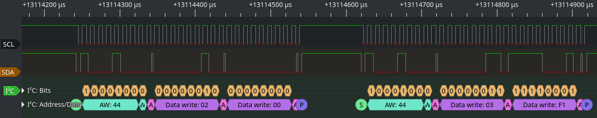

# VXIS USB3 HDMI Capture Firmware Mod

Low-cost USB3 HDMI capture cards with VXIS chipset usually come with a sharpening filter enabled. The sharpening filter is fine for movies and video games but not what you would want for screen capturing. Unfortunately, the manufacture didn't expose any interface to turn this off. Therefore, below will detail how I had modified and managed to get rid of the filter.

**DISCLAIMER:** This information is provided 'as is' without warranty of any kind. Use it at your own risk. We can't be held accountable for broken devices or things that went wrong.

## Hardware


This particular device is branded "Wiistar USB3.0 HD Capture" which currently retails for around $40 on [AliExpress](https://www.aliexpress.com/item/4001044872081.html) and the same one for $55 on [Amazon](https://www.amazon.com/gp/product/B083HWLHF5) with faster shipping if you are in the US. From the advertised specification, it can output 1080p@60Hz in YUY2. Note the USB-C port only work in one orientation for SuperSpeed, the other orientation will show up as a USB2 device and is limited to MJPEG only.

v4l2 show the following supported format:
```
Driver Info:
        Driver name      : uvcvideo
        Card type        : FHD Capture: FHD Capture
        Bus info         : usb-0000:2a:00.3-3
        Driver version   : 5.10.6
        Capabilities     : 0x84a00001
                Video Capture
                Metadata Capture
                Streaming
                Extended Pix Format
                Device Capabilities
        Device Caps      : 0x04200001
                Video Capture
                Streaming
                Extended Pix Format
ioctl: VIDIOC_ENUM_FMT
        Type: Video Capture

        [0]: 'MJPG' (Motion-JPEG, compressed)
                Size: Discrete 1920x1080
                        Interval: Discrete 0.017s (60.000 fps)
                        Interval: Discrete 0.033s (30.000 fps)
                Size: Discrete 640x480
                        Interval: Discrete 0.017s (60.000 fps)
                        Interval: Discrete 0.033s (30.000 fps)
                Size: Discrete 800x600
                        Interval: Discrete 0.017s (60.000 fps)
                        Interval: Discrete 0.033s (30.000 fps)
                Size: Discrete 1024x768
                        Interval: Discrete 0.017s (60.000 fps)
                        Interval: Discrete 0.033s (30.000 fps)
                Size: Discrete 1280x720
                        Interval: Discrete 0.017s (60.000 fps)
                        Interval: Discrete 0.033s (30.000 fps)
                Size: Discrete 1280x960
                        Interval: Discrete 0.017s (60.000 fps)
                        Interval: Discrete 0.033s (30.000 fps)
                Size: Discrete 1280x1024
                        Interval: Discrete 0.017s (60.000 fps)
                        Interval: Discrete 0.033s (30.000 fps)
                Size: Discrete 1360x768
                        Interval: Discrete 0.017s (60.000 fps)
                        Interval: Discrete 0.033s (30.000 fps)
                Size: Discrete 1400x900
                        Interval: Discrete 0.017s (60.000 fps)
                        Interval: Discrete 0.033s (30.000 fps)
                Size: Discrete 1440x900
                        Interval: Discrete 0.017s (60.000 fps)
                        Interval: Discrete 0.033s (30.000 fps)
        [1]: 'YUYV' (YUYV 4:2:2)
                Size: Discrete 1920x1080
                        Interval: Discrete 0.017s (60.000 fps)
                        Interval: Discrete 0.033s (30.000 fps)
                Size: Discrete 640x480
                        Interval: Discrete 0.017s (60.000 fps)
                        Interval: Discrete 0.033s (30.000 fps)
                Size: Discrete 800x600
                        Interval: Discrete 0.017s (60.000 fps)
                        Interval: Discrete 0.033s (30.000 fps)
                Size: Discrete 1024x768
                        Interval: Discrete 0.017s (60.000 fps)
                        Interval: Discrete 0.033s (30.000 fps)
                Size: Discrete 1280x720
                        Interval: Discrete 0.017s (60.000 fps)
                        Interval: Discrete 0.033s (30.000 fps)
                Size: Discrete 1280x960
                        Interval: Discrete 0.017s (60.000 fps)
                        Interval: Discrete 0.033s (30.000 fps)
                Size: Discrete 1280x1024
                        Interval: Discrete 0.017s (60.000 fps)
                        Interval: Discrete 0.033s (30.000 fps)
                Size: Discrete 1360x768
                        Interval: Discrete 0.017s (60.000 fps)
                        Interval: Discrete 0.033s (30.000 fps)
                Size: Discrete 1400x900
                        Interval: Discrete 0.017s (60.000 fps)
                        Interval: Discrete 0.033s (30.000 fps)
                Size: Discrete 1440x900
                        Interval: Discrete 0.017s (60.000 fps)
                        Interval: Discrete 0.033s (30.000 fps)
```
### Top view


### Bottom view


### Block Diagram


From the block diagram above, we can guess that the sharpening process is done by the VXIS VS9989 video processor. Apart from a [brief datasheet](http://www.vxis.com/html/pdf/VS9989_bf_v1.3.pdf) provide by VXIS, not a lot of information was available online. However, from the brief datasheet, it provides the pinout and that the chip has an i2c host interface. the host interface is used by the VS2828 USB controller chip to configure the video processor. If we can find the right register and the right bit to flip, we can disable the sharpening filter.

### VS9989 i2c


Using Sigrok and an FTDI mini module as a logic analyzer, i2c bus communications during various stages of operations were captured to understand the protocol and to see what registers that it the firmware access. By doing so, the function of each register could be reasonably deduced.


Trace capture when power up the capture device. Here, the firmware tried to access the i2c slave with address 0x4c, however, all the write access got NACK so the device isn't available on the i2c bus. All transactions were for slave address 0x4c during the boot-up stage and the i2c bus is clocked at ~150Khz.



Trace capture when starting video capture. When starting up, the controller wrote to the i2c address 0x44 with ACK from the slave. As such, the 0x44 address is the i2c address for the host interface of the VS9989 chip. From the trace capture, the host interface protocol is an 8-bit register address followed by an 8-bit register value. Here, it wrote 0x00 to register 0x02 and 0xf1 to register 0x03.

Using python and pyftdi library, I wrote a [python script](scripts/i2c_explore.py) that scan the i2c bus and send arbitrary i2c commands using the FTDI mini module to understand what each register does.

The scan revealed that 0x44 is the only device on the i2c bus.

```
     0  1  2  3  4  5  6  7  8  9  a  b  c  d  e  f
00: -- -- -- -- -- -- -- -- -- -- -- -- -- -- -- -- 
10: -- -- -- -- -- -- -- -- -- -- -- -- -- -- -- -- 
20: -- -- -- -- -- -- -- -- -- -- -- -- -- -- -- -- 
30: -- -- -- -- -- -- -- -- -- -- -- -- -- -- -- -- 
40: -- -- -- -- 44 -- -- -- -- -- -- -- -- -- -- -- 
50: -- -- -- -- -- -- -- -- -- -- -- -- -- -- -- -- 
60: -- -- -- -- -- -- -- -- -- -- -- -- -- -- -- -- 
70: -- -- -- -- -- -- -- -- -- -- -- -- -- -- -- -- 
```

To look for the setting that disables the filter, I flipped random bits in the register space and monitored the stream output. Some behaviors from my testing are documented in [reg_note.md](notes/reg_note.md). From observation, register 0x11 - bit 3 controls the sharpening filter. By flipping the bit to 0, the filter can be disabled. Looking at the start capture trace, a command was sent by the VS2929 chip to write to this register. Therefore, the firmware of the USB controller must be inspected to patch out the filter enable call.

```
[Start]
    [Address write: 44] [Write] [ACK]
    [Data write: 11] [ACK]
[Start repeat]
    [Address read: 44] [Read] [ACK]
    [Data read: 20] [NACK]
[Stop]

[Start]
    [Address write: 44] [Write] [ACK]
    [Data write: 11] [ACK]
    [Data write: 38] [ACK]
[Stop]
```

I couldn't find any information for this chip but luckily the SPI flash is available on the backside of the board. I used flashrom and the FTDI module to dump out the SPI flash. FTDI chip is handy for HW hacking :P The dump of the SPI flash contains 8051 code and a random bitmaps pattern. Decompiled the dump with IDA and I found the code that enables the filter. Nop out the i2c_write call at 0xF7D effectively disable the filter.


Currently, an external programmer is needed to reprogram the SPI flash. But there must be a way to do this over the USB interface. I haven't found a way to do so yet.
